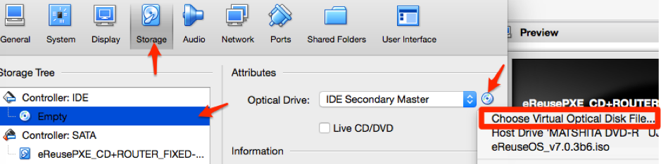

# eReuse: How to use our (PXE) server

This server allow us to register easily and very fast by sending DeviceInventory to all PC 
connected on the LAN network.

#### To register we need the following

- A PC with:
  - [VirtualBox](https://www.virtualbox.org/wiki/Downloads)
  - [eReusePXEserver-<VERSION>.ova](https://github.com/eReuse/device-inventory/releases/latest)
  - [eReuseOS-<VERSION>.iso](https://github.com/eReuse/device-inventory/releases/latest)
  - Optionally, some FSArchiver system installation images to be installed in computers. Create in your PC a folder called ``ereuse-data``, another one inside of it called ``images``, and copy the images in the latter.
- Switch
- Network cables
- PC to register

**Note on system installation images:** Currently the only kind of images supported and assumed are FSArchiver images corresponding to 32-bit ``i386`` or 64-bit ``amd64`` Debian/Ubuntu or derivative OS installations, where the whole system is contained in a single ext4 file system in BIOS partition ``sda1``, and GRUB2 is used as a bootloader.

**How to create a FSArchiver image:** To prepare an installation image you must perform in a different machine (either real or virtual) the complete installation that you want to replicate (taking into account the limitations from the previous note).  One possible way to capture this installation to a FSArchiver image is to reboot the already installed machine into the [SystemRescueCd](https://www.system-rescue-cd.org/SystemRescueCd_Homepage), then enter the keyboard language, plug an external USB drive of sufficient capacity (note that FAT file systems may cause file size limitation issues) and run the following commands:

```
# mount /dev/sdb1 /mnt  # ``sdb`` is the external USB drive
# fsarchiver savefs /mnt/IMAGE_NAME.fsa /dev/sda1  # ``sda`` is the main hard drive
# umount /mnt  # wait until the command is complete
```

Use some informative ``IMAGE_NAME`` like ``lubuntu-xenial-amd64-ca``.  Now you can plug the USB drive into your PC and copy the image to it.

####Steps to install and setup the server:
1. Disconnect any router (any DHCP provider in general) from the network. Just use the switch or hub.
2. Install VirtualBox on any Win/Linux/Mac computer. We will call this computer as the *host*.
2. Double click on `eReusePXEserver-<VERSION>.ova` to import the server on VirtualBox.
3. Check the network configuration on VirtualBox.
  1. Adapter 1 should be on Ethernet (cable) interface with others computer (to be registed): 
  2. Adapter 2 should be on NAT if you have a second ethernet slot or WiFi adapter.
4. Insert [DeviceInventory](https://github.com/eReuse/device-inventory/releases/latest) (download it from Downloads section, at the bottom) as CD media: 
5. In the machine settings, select the *Shared Folders* tab, then the ``ereuse-data`` entry in the list and click on the edit button (orange) on the right. In the following dialog, click on the drop down list, then on *Other…* and choose the ``ereuse-data`` folder that you created at the beginning, then accept the new configuration: 
6. Run the virtual server and wait until it asks for *login*. There is no need for login. Now you [can start registering your computers](#register-a-computer), or [configure the server to automate tasks](#configure-iso-options)

####Register a computer
1. Connect a PC on the LAN network.
2. Configure the BIOS (the first few seconds when computer starts) to boot first from LAN:
  1. Maybe there is an option to automatically boot from the network. 
    - Watch for the BIOS Setup Message. 
    - Press F12, F8 or F9 to enter on boot menu selection.
  2. Enter to Setup and change the boot priority.
    - Watch for the BIOS Setup Message.
    - Press F2 or F10 to enter on BIOS menu.
3. When the computer starts on LAN it will load the image from the server (it can take some time).
4. Follow [this guide about the inventory process](https://github.com/eReuse/device-inventory/blob/master/docs/USB_Register.md#4-inventory-process-register-hardware-characteristics-of-a-computer)
5. The file will be automatically uploaded to the PXE Server, but you can still copy it too to a USB memory stick.

The generated files of all computers will be stored in a public folder in the PXE Server. To access the folder from the host machine, first setup the host's network interface associated with Adapter 1 in the server to configure itself using DHCP; then you may access as the public user (which can be called guest, public or anonymous) the address `\\192.168.2.2\` in Windows Explorer, or `smb://192.168.2.2/` in a Linux box or after pressing <kbd>⌘</kbd><kbd>K</kbd> in Mac's Finder.

####Install a computer
After registering the computer, you may want to perform an installation from one of the FSAarchiver system images in the shared folder that you attached to the server. After the diagnostic and inventory process has completed, you will be given the chance to perform the installation. Follow the instructions in the screen to proceed and select one of the images (both steps can be automated via the ``config.ini`` file, see below).  After some minutes, the installation will be complete and you will be able to boot into the new system with Ctrl+Alt+Supr or by running ``sudo reboot``.

####Configure ISO options
You can automatize tasks of DeviceInventory by modifying the configuration file ([config.ini](https://github.com/eReuse/device-inventory/blob/master/device_inventory/config.ini)). For example, you can set to always erase disks in a specific way, or to automatically install some image, so the system will not ask the user about this, avoiding spending time and user errors. To modify the configuration file on the server, do the following:

1. On the server machine from VirtualBox, login with the credentials (username: ereuse, password: ereuse).
2. write in the terminal `nano /home/ereuse/config.ini`
3. Enable or disable all the options that you want.
4. Save the changes pressing <kbd>Ctrl</kbd><kbd>O</kbd> and enter. Exit with <kbd>Ctrl</kbd><kbd>X</kbd>.

Please check the comments in the `config.ini` file itself for documentation on the different configuration options.

####Server info: 
- IP address: 192.168.2.2 
- User: ereuse (password: ereuse) 
- Root password: eReuse 
- Shared folder: 
  - Windows: `\\192.168.2.2\`
  - Linux: `smb://192.168.2.2/`

There is two network interfaces on the VirtualBox server.
  - eth0 (adapter 1): On “Bridged Adapter” on ethernet interface connected on the LAN with the other PCs to register.
  - eth1 (adapter 2): On “NAT” to connect on Internet from PC (if you have another interface with Internet like WiFi).
