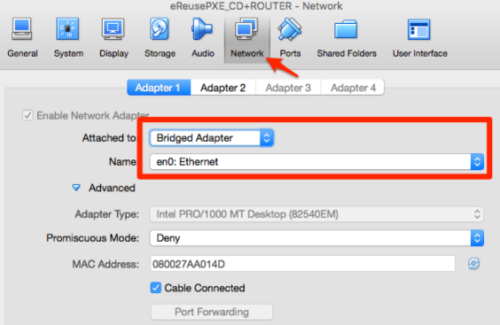
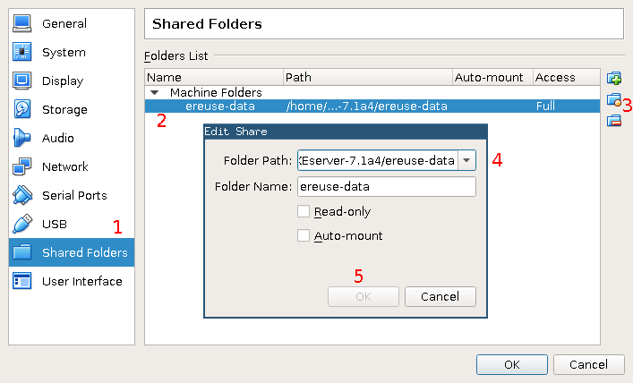

# eReuse: How to use our (PXE) server

This server allow us to register easily and very fast by sending DeviceInventory to all PCs connected on the LAN network.

## Requirements

  - A network switch (at least 100 Mbps, 1 Gbps recommended)
  - Network cables
  - A Win/Linux/Mac PC with:
      - [VirtualBox](https://www.virtualbox.org/wiki/Downloads)
      - [ereuse-server-<VERSION>.ova](https://github.com/eReuse/device-inventory/releases/latest)
      - [ereuse-data-<VERSION>.tar.gz](https://github.com/eReuse/device-inventory/releases/latest)
      - FSArchiver system images of existing installations, if you want to deploy copies of those installations into inventoried computers
      - Installation ISOs, if you want to use them to install a GNU/Linux OS into inventoried computers
  - PCs to be inventoried

**Note on installation ISOs:** Only a small set of Debian/Ubuntu live distros based on Casper are supported by default. If you want to add more you will need write your own ``NAME.iso.syslinux`` template (see below).

**Note on system installation images:** Currently the only kind of images supported and assumed are FSArchiver images corresponding to 32-bit ``i386`` or 64-bit ``amd64`` Debian/Ubuntu or derivative OS installations, where the whole system is contained in a single ext4 file system in BIOS partition ``sda1``, and GRUB2 is used as a bootloader.

**How to create a FSArchiver image:** To prepare an installation image you must perform in a different machine (either real or virtual) the complete installation that you want to replicate (taking into account the limitations from the previous note).  One possible way to capture this installation to a FSArchiver image is to reboot the already installed machine into the [SystemRescueCd](https://www.system-rescue-cd.org/SystemRescueCd_Homepage), then enter the keyboard language, plug an external USB drive of sufficient capacity (note that FAT file systems may cause file size limitation issues) and run the following commands:

```
# mount /dev/sdb1 /mnt  # ``sdb`` is the external USB drive
# fsarchiver savefs /mnt/IMAGE_NAME.fsa /dev/sda1  # ``sda`` is the main hard drive
# umount /mnt  # wait until the command is complete
```

Use some informative ``IMAGE_NAME`` like ``lubuntu-xenial-amd64-ca``.  Now you can plug the USB drive into your PC and copy the ``.fsa`` file into the ``images`` directory under the folder shared between your PC and the virtual server.

## Installing and setting up the server

If you are upgrading from a previous version of the server, make sure that you stop it first and rename the ``ereuse-data`` folder (e.g. to ``ereuse-data.backup``).

 1. Disconnect any router (any DHCP provider in general) from the network.  Just use the switch or hub.
 2. Install VirtualBox on your PC.
 3. Unpack the ``ereuse-data-<VERSION>.tar.gz`` in your PC.  A new folder called ``ereuse-data`` will be created with several files and directories inside of it.

      - You can configure DeviceInventory to avoid asking questions and automate tasks by editing the ``config.ini`` configuration file.  For example, you can set to always erase disks in a specific way, or to automatically install some image, so the system will not ask the user about this, saving time and user errors.  Documentation on the different configuration options is contained in the file itself.
      - Place any FSArchiver ``*.fsa`` images that you want to use into the ``images`` subdirectory.  Remember to give them meaningful names.
      - Place any installation ISO ``*.iso`` images that you want to use into the ``images`` subdirectory (the latest eReuseOS ISO is already provided).  For an ISO to appear in the PXELINUX boot menu, you need to create a SYSLINUX entry template file with the exact same name as the ISO file (case is important!), plus ``.syslinux`` at the end.  Some templates are provided, so you just need to rename the ISO file to match the template (e.g. for the ``Ubuntu32.iso.syslinux`` template, use ``Ubuntu32.iso``).
      - The inventory files resulting from computer registration will be placed into the ``inventory`` subdirectory.

 4. Run VirtualBox and click on *File / Import Appliance…*.  Select `ereuse-server-<VERSION>.ova` and follow the default steps to import the server.
 5. Select the newly created machine and click on *Settings* to check the network configuration on VirtualBox:

      - Adapter 1 should be bridged to the Ethernet (cable) interface where other computers are connected:

        

      - Adapter 2 should be on NAT if you have a second Ethernet slot or WiFi adapter.

 6. In the machine settings, select the *Shared Folders* tab, then the ``ereuse-data`` entry in the list and click on the edit button (orange) on the right. In the following dialog, click on the drop down list, then on *Other…* and choose the ``ereuse-data`` folder that you created above, then accept the new configuration:

    

 7. If your PC supports hardware virtualization (VT-x/AMD-V), make sure to enable it in the machine settings, under *System / Acceleration*.
 8. Run the virtual server and wait until it asks for *login* (there is usually no need to login).  Now you can start [registering your computers](#register-a-computer).

## Registering a computer

 1. Connect a PC on the LAN network.
 2. Configure the BIOS (the first few seconds when the computer starts) to boot first from LAN:

     1. Maybe there is an option to automatically boot from the network:

        - Watch for the BIOS Setup Message.
        - Press F12, F8 or F9 to enter on boot menu selection.

     2. Enter Setup and change the boot priority:

        - Watch for the BIOS Setup Message.
        - Press F2 or F10 to enter on BIOS menu.

 3. When the computer starts on LAN it will load the eReuseOS image from the server (it can take some time).
 4. Follow [this guide about the inventory process](https://github.com/eReuse/device-inventory/blob/master/docs/USB_Register.md#4-inventory-process-register-hardware-characteristics-of-a-computer)
 5. The file will be automatically uploaded to the PXE server and become available under the ``ereuse-data/inventory`` subdirectory in your PC, but you can still copy it too to a USB memory stick.

## Installing a computer

After registering the computer, you may want to perform an installation.

If you want to perform an installation from one of the FSAarchiver system images in the shared folder that you attached to the server, after the diagnostic and inventory process has completed, you will be given the chance to perform the installation.  Follow the instructions in the screen to proceed and select one of the images (both steps can be automated via the ``config.ini`` file, see above).  After some minutes, the installation will be complete and you will be able to boot into the new system with Ctrl+Alt+Supr or by running ``sudo reboot``.

Otherwise, you may want to use one of the installation ISOs that you configured in the ``ereuse-data/images`` subdirectory.  In that case reboot the computer (with Ctrl+Alt+Supr or by running ``sudo reboot``) and ensure that it boots again via PXE (see the previous section).  As soon as the ``boot:`` prompt appears, be quick to hit Tab to see the boot options.  Besides the ``eReuseOS`` option (which is used to run the computer registration, as explained before), you should be able to see a list of supported installation ISOs.  Enter the one you want and boot the installer by hitting Enter.

## Server info

 - IP address: 192.168.2.2
 - User: ereuse (password: ereuse)
 - Root password: eReuse
 - Shared folder:

    - Windows: `\\192.168.2.2\`
    - Linux: `smb://192.168.2.2/`

The ``ereuse-data`` directory in your PC will be shared to the installation network by the PXE server.  To access the folder from another machine, connect it to that network and setup the network card to autoconfigure itself using DHCP; then you may access as the public user (which can be called `guest`, `public` or `anonymous`) the address `\\192.168.2.2\` in Windows Explorer, `smb://192.168.2.2/` in a Linux box, or after pressing <kbd>⌘</kbd><kbd>K</kbd> in Mac's Finder.
