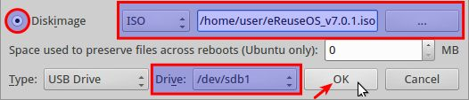

# eReuse: How to register via USB 

####1. Download the eReuseOS image
  1. Go to [our repository](https://github.com/eReuse/Device-Inventory/releases/latest) and download the latest ISO.
  2. Install [UNetbootin](https://unetbootin.github.io/) software to make a USB live.
    - [Windows](https://launchpad.net/unetbootin/trunk/613/+download/unetbootin-windows-613.exe)
    - [Mac](https://launchpad.net/unetbootin/trunk/613/+download/unetbootin-mac-613.zip)
    - Ubuntu: open the terminal `Ctrl + Alt + T` and execute `sudo apt-get update && sudo apt-get install unetbootin -y && unetbootin`

####2. Create a bootable live USB with UNetbootin
*NOTE: it’s recommended that the USB is blank before saving the image to it.*
  1. Select “Diskimage”.
  2. Select where is the disk image file.
  3. Select the Drive to write.
  4. Click `ok` to start.

  

####3. Run eReuseOS
  1. Connect the USB with the eReuseOS image to the PC where you are going to register.
  2. Configure the BIOS (the first few seconds when computer starts) to boot on USB.
  1. Maybe there is a option to automatically boot from USB.
    - Watch for the BIOS Setup Message.
    - Press F12, F8 or F9 to enter on boot menu selection.
  2. Enter to Setup and change the boot priority.
    - Watch for the BIOS Setup Message. 
    - Press F2 or F10 to enter on BIOS menu. 

####4. Inventory process register hardware characteristics of a computer
1. User login.
    - Login user: `ubuntu` Password: `(empty, no password)`
2. Run device inventory
    - Write `sudo device-inventory` on the terminal.

  

3. Fill the following fields:
   - Label (optional): to help identifying the PC. (e.g.: PC­1, PC­2, PC­3...) .
   - Comment (optional): to introduce extra information (e.g. describe If any of peripheral equipment does not work).

4. Device type: choose what kind of equipment are you registering (e.g.: Desktop, Laptop, etc).

5. Wait until inventory of equipment is completed (it will take less than a minute).

6. You will be asked to insert another USB drive to store the result, just plug­in and wait until the result is saved.

7. Process is done! If you want to review the result open the file stored on the USB on another computer or just run this command on the inventoried device (where “your_filename” is the name of the file printed on the screen):

  
  - `less /tmp/your_filename.json`

8. Press `q` to quit the program, unplug the USB and you can power off the computer.
  - `sudo poweroff`  # introduce this command or just press computer’s power button 
